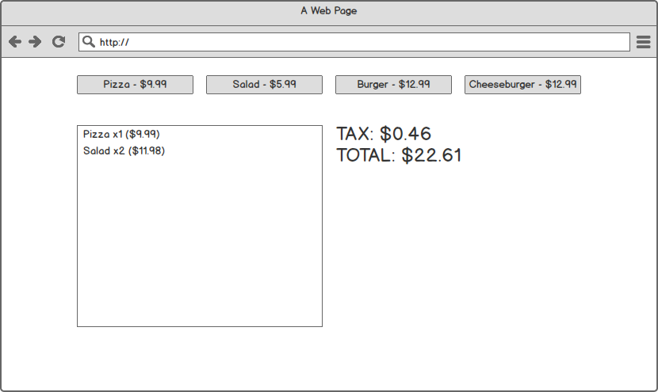

# Angular Cash Register

Build a very simple cash register application. It should have/do the following:

* Include clickable buttons/links at the top that add to a section on the left-hand side.
* As you add each item, the tax and total should immediately change.

